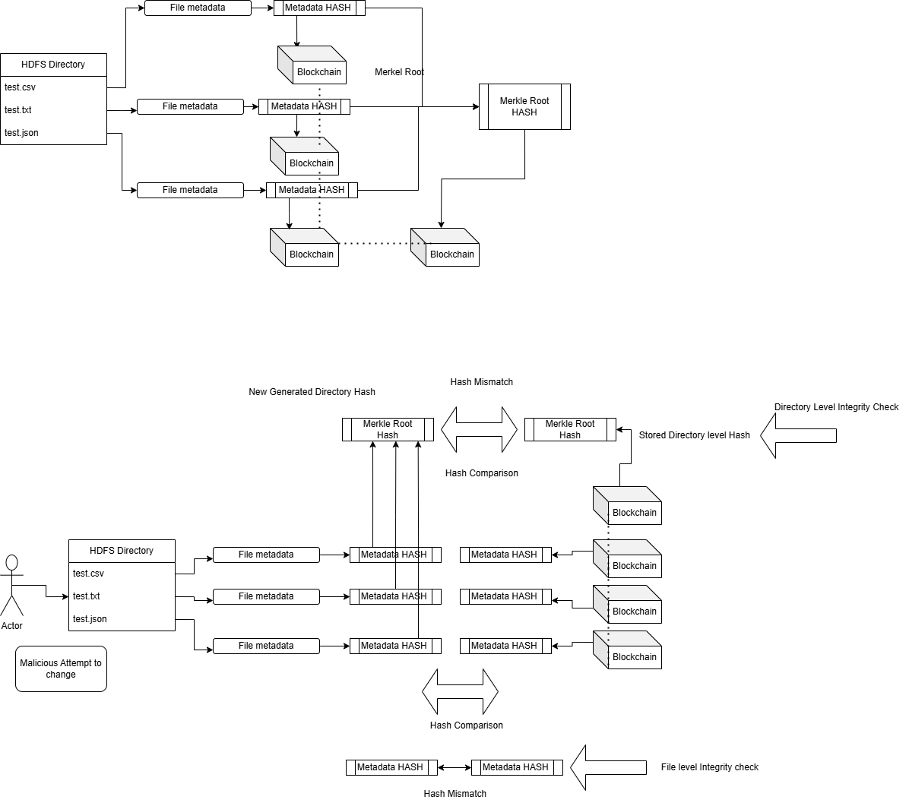

Overview of the Project
This project implements a Blockchain-Based File Integrity Verification System that integrates Hadoop Distributed File System (HDFS) and Ethereum Blockchain to ensure the integrity of files and directories. It addresses the need to detect tampering or malicious modifications to files stored in a distributed environment. By leveraging blockchain's immutability, the system tracks file metadata and directory-level hashes to detect unauthorized changes.

Acknowledgments
I extend my deepest gratitude to Professor Balaji Palanisamy of the School of Computing and Information at the University of Pittsburgh for his invaluable insights and expertise. His guidance in the fields of distributed systems and blockchain technology has significantly contributed to the successful completion of this project.

